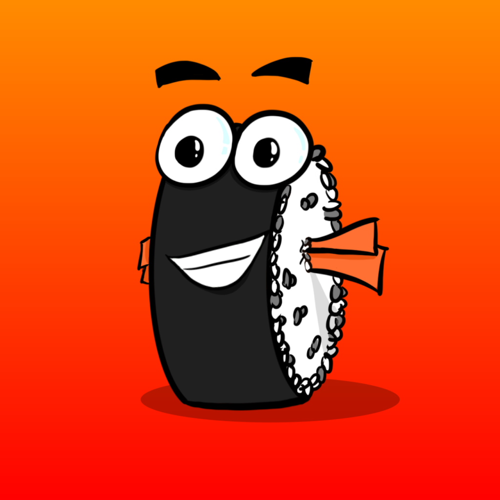
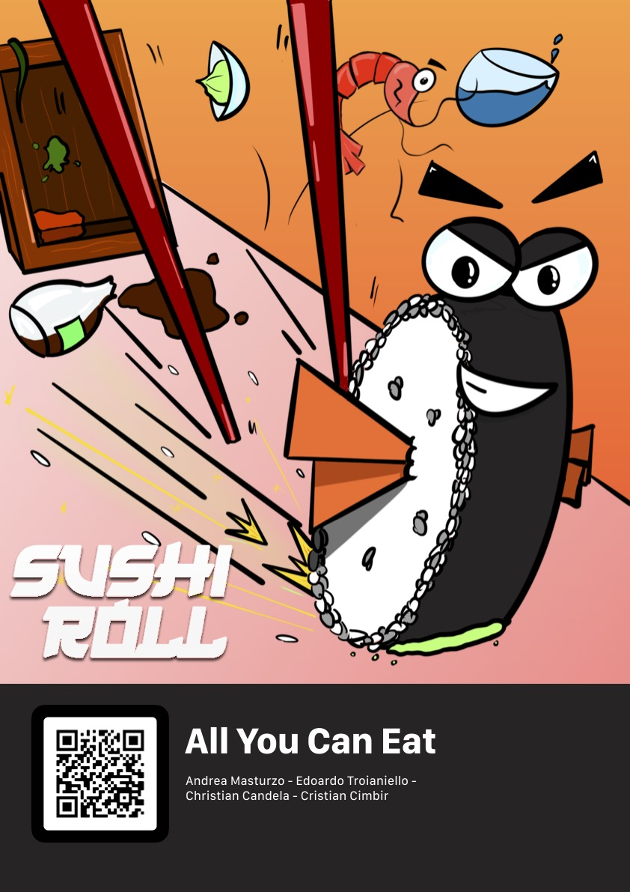
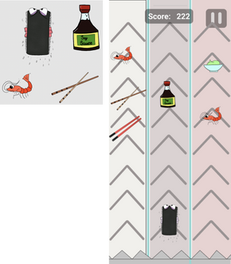
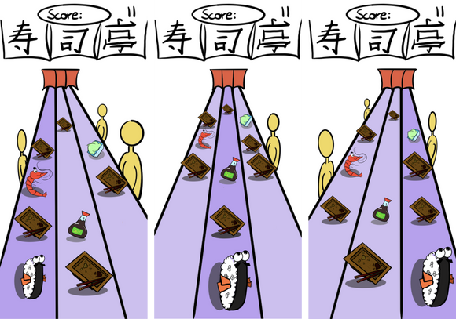
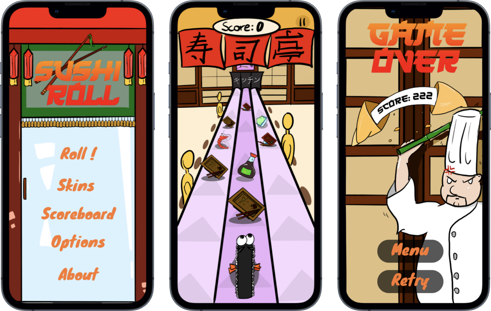
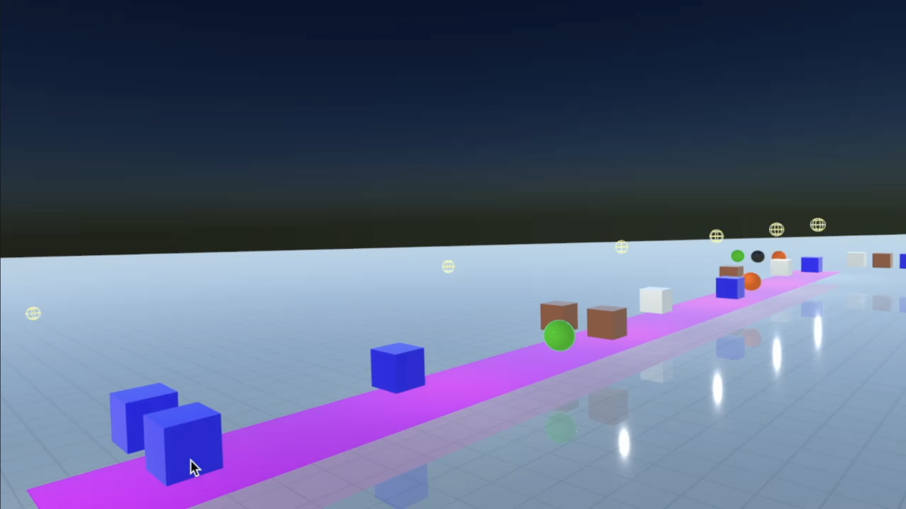

# SushiRoll Overview

**SushiRoll** is a 3D game created by
## Team All You Can Eat:
* [Edoardo Troianiello](https://github.com/eddy10957)
* [Andrea Masturzo](https://github.com/AndreaMasturzo)
* [Christian Candela](https://github.com/ChrisCande)
* [Cristian Cimbir](https://github.com/cristiancimbir)

  

SushiRoll is an endless iOS 3D game. 
With its intuitive mechanics and cartoonish graphics it is meant for everybody, from a casual gamer to the most competitive one. 

This game is the result of a long research and study process. We started from the idea of an endless game, selected a theme (Sushi) and made our first iterations in 2 dimensions, drawing every asset by hand.

So what started as a flat, boring interface became a more complex and catchy concept.

We then decided to take a step further and trasported all those drawings into 3D, trying to maintain the design as engaging as it was on paper. 
After a full immersion into SceneKit and its engine, we deployed it on TestFlight to collect as much data and feedbacks as possible. 
Hope you can enjoy it as much as we did!

<video src='Assets/SushiRollDemo.mov' width=828/>

